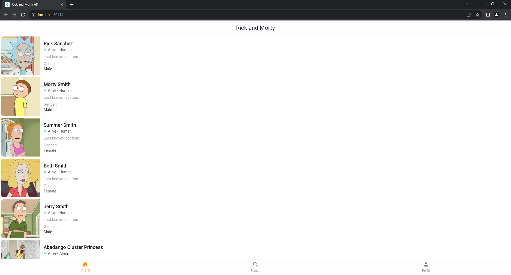

# Package structure

    ├── api                # For data handling.
    ├── models             # Model classes
    ├── ui                 # UI/View layer
    │   ├── home           # Character List Screen 
    │   └─ details         # Character Details Screen

# Screenshot

